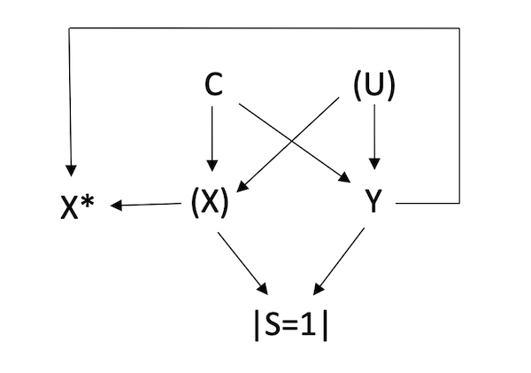

# multibias
R package for multi-bias analysis

## Overview

multibias is a set of functions that provide odds ratio estimates that are adjusted for any combination of uncontrolled confounding, selection bias, and exposure misclassification:

  - `adjust_uc_sel()` adjusts for uncontrolled confounding and selection bias.
  - `adjust_mc_sel()` adjusts for exposure misclassification and selection bias.
  - `adjust_uc_mc()` adjusts for uncontrolled confounding and exposure misclassificaiton.
  - `adjust_uc_mc_sel()` adjusts for all three biases.
 
 If you are new to bias analysis, I'd recommend checking out the [Applying Quantitative Bias Analysis to Epidemiologic Data](https://www.springer.com/us/book/9780387879604) textbook or visiting my [website](https://pcbrendel.github.io/).

## Installation

```{r, eval = FALSE}
# install.packages("devtools")
devtools::install_github("pcbrendel/multibias")
```

## Usage

Say you have a data set whose causal relationships can be represented in the following DAG:



The variables are defined:
 - X: true, unmeasured exposure
 - Y: outcome
 - C: measured confounder(s)
 - U: unmeasured confounder
 - X*: misclassified, measured exposure
 - S: selection (into the study)

It can be seen from this DAG that the data suffers from three sources of bias. There is uncontrolled confounding from (unobserved) variable U. The true exposure, X, is unobserved, and the misclassified exposure X* is dependent on both the exposure and outcome. Lastly, there is collider stratification at variable S, representing selection into the study. The study naturally only examines those who were selected (i.e. those with S=1).

A simulated data set corresponding to this DAG, `df_uc_mc_sel` can be loaded from the multibias package. 

```{r, eval = TRUE}
library(multibias)
head(df_uc_mc_sel)
#>   Xstar Y C1 C2 C3
#> 1     0 1  1  0  1
#> 2     1 0  0  0  1
#> 3     1 1  0  0  1
#> 4     0 0  0  1  1
#> 5     0 0  0  0  0
#> 6     0 0  0  1  0
```

In this data set, the true exposure-outcome odds ratio equals 2. However, when we run a logistic regression, we do not observe an odds ratio of 2 due to the multiple bias sources.

```{r, eval = TRUE}
biased_model <- glm(Y ~ Xstar + C1 + C2 + C3, data = df_uc_mc_sel, family = binomial(link = "logit"))
exp(coef(biased_model)[2])
#>    Xstar
#> 1.663475
```

The `adjust` family of functions serves to "reconstruct" the unbiased data and return the exposure-outcome odds ratio that would be observed in the unbiased setting.

Models for the missing variables (U, X, S) are used to facilitate this data reconstruction. For the above DAG, these models are:


We will run the analysis over 1,000 bootstrap samples to obtain a valid confidence interval that incorporates uncertainty in the random error and systematic error. To improve performance we will run the analysis in parallel using the doParallel package. 

```{r, eval = TRUE}
library(doParallel)

no_cores <- detectCores() - 1
registerDoParallel(cores = no_cores)
cl <- makeCluster(no_cores)

set.seed(1234)
nreps <- 1000
est <- vector(length = nreps)
```


