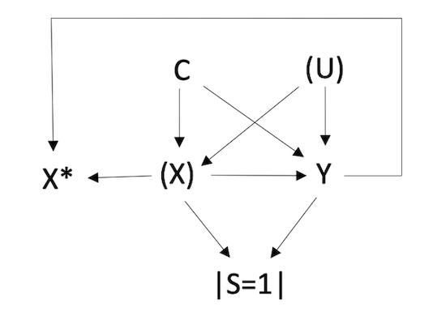

```{r, include = FALSE}
knitr::opts_chunk$set(
  collapse = TRUE,
  comment = "#>"
)
```

```{r setup}
library(multibias)
```

## Single Bias Example

We are interested in quantifying the effect of smoking (SMK) on coronary heart disease (CHD) using data from the [Evans County Heart Study](https://en.wikipedia.org/wiki/Evans_County_Heart_Study). Let's inspect the dataframe we have for 609 participants aged 40 and older.

```{r, eval = TRUE}
head(evans)
```

This is clearly not the most robust data, but, for purposes of demonstration, let's proceed by pretending that our data was missing information on age. Let's see what the resulting odds ratio estimate looks like without adjustment for age and with adding hypertension (HPT) as a known confounder.

```{r, eval = TRUE}
biased_model <- glm(CHD ~ SMK + HPT,
                    family = binomial(link = "logit"),
                    data = evans)
or <- round(exp(coef(biased_model)[2]), 2)
or_ci_low <- round(exp(coef(biased_model)[2] -
                         1.96 * summary(biased_model)$coef[2, 2]), 2)
or_ci_high <- round(exp(coef(biased_model)[2] +
                          1.96 * summary(biased_model)$coef[2, 2]), 2)

print(paste0("Biased Odds Ratio: ", or))
print(paste0("95% CI: (", or_ci_low, ", ", or_ci_high, ")"))
```

This estimate, despite not adjusting for age, appears around what we would expect. In the IJE article [The association between tobacco smoking and coronary heart disease](https://academic.oup.com/ije/article/44/3/735/633393) the author notes: "Cigarette smokers have about twice as much coronary heart disease as non-smokers, whether measured by deaths, prevalence, or the incidence of new events." However, we also know from studies like [this BMJ meta-analysis](https://www.bmj.com/content/360/bmj.j5855#:~:text=The%20pooled%20relative%20risks%20for%20coronary%20heart%20disease%20associated%20with,all%20studies%20in%20table%201.) that the effect estimate can vary greatly depending on the degree of cigarette consumption. We also observe a wide confidence interval due to the small sample size of the data. In real-world practice we would want to obtain better data that includes more observations, participant estimates of cigarettes smoked/day, and other important confounders including sex and race/ethnicity. In Epidemiology it is very rarely the case that we have the "perfect" data with everything we would like! We'll proceed with the analysis knowing the limitations of the data.

Can we anticipate whether this biased odds ratio (without age-adjustment) is biased toward or away from the null? Let's consider the association of the uncontrolled confounder with the exposure and outcome. In our data, age has a negative association with smoking (older people are **less** likely to be smokers) and a positive association with heart disease (older people are **more** likely to have CHD). These opposite associations are biasing the odds ratio towards the null, creating a distortion where those who are less likely to smoke are more likely to experience the outcome.

To adjust for AGE, where we're assuming it's missing in the data, let's refer to the appropriate bias model for a binary uncontrolled confounder (we're going to treat age as a binary indicator of over (1) or under (0) age 60):

* logit(P(U=1)) = &alpha;<sub>0</sub> + &alpha;<sub>1</sub>X + &alpha;<sub>2</sub>Y + &alpha;<sub>2+j</sub>C<sub>j</sub>

It's now time for the most difficult part of quantitative bias analysis - deriving bias parameters. Using all the information at our disposal, this is where we provide assumptions for how the relevant variables in our data are related to the uncontrolled confounder. This experience is comparable to that of providing priors in a Bayesian statistical analysis.

Starting with exposure, we'll assume that smokers are half as likely to have an age >60 than non-smokers, those with CHD are 2.5x as likely to have an age>60 than those without CHD, and those with hypertension are 2x as likely to have an age>60 than those without HPT. To convert these relationships as parameters in the model, we'll log-transform them from odds ratios (see below). Lastly, for the model intercept, we can use the following reasoning: what is the probability that a non-smoker (X=0) without CHD (Y=0) and HPT (C=0) is over age 60 in this population? We'll say this is a 25% probability. We'll use the 'inverse logit' function `qlogis()` from the `stats` package to convert this from a probability to the intercept coefficient of the logistic regression model.   

```{r, eval = TRUE}
u_0 <- qlogis(0.25)
u_x <- log(0.5)
u_y <- log(2.5)
u_c <- log(2)
```

Now let's plug these bias parameters into `adjust_uc()` to obtain our bias-adjusted odds ratio.

```{r, eval = TRUE}
set.seed(1234)
adjust_uc(
  data = evans,
  exposure = "SMK",
  outcome = "CHD",
  confounders = "HPT",
  u_model_coefs = c(u_0, u_x, u_y, u_c)
)
```

We get an odds ratio of 2.16 (95% CI: 1.20, 3.91). This matches our expectation that the bias adjustment would pull the odds ratio away from the null. How does this result compare to the result we would get if age *wasn't* missing in the data and was incorporated in the outcome regression? The results are below. It turns out that our bias-adjusted odds ratio using `multibias` is close to this complete-data odds ratio of 2.31. 

```{r, eval = TRUE}
full_model <- glm(CHD ~ SMK + HPT + AGE,
                  family = binomial(link = "logit"),
                  data = evans)
or <- round(exp(coef(full_model)[2]), 2)
or_ci_low <- round(exp(coef(biased_model)[2] -
                         1.96 * summary(full_model)$coef[2, 2]), 2)
or_ci_high <- round(exp(coef(biased_model)[2] +
                          1.96 * summary(full_model)$coef[2, 2]), 2)

print(paste0("Odds Ratio: ", or))
print(paste0("95% CI: (", or_ci_low, ", ", or_ci_high, ")"))
```

## Triple Bias Example

We are interested in quantifying the effect of exposure X on outcome Y. The causal system can be represented in the following directed acyclic graph (DAG):

```{r out.width = '70%', echo = FALSE}

```

The variables are defined:

* X: true, unmeasured exposure
* Y: outcome 
* C: measured confounder(s)  
* U: unmeasured confounder  
* X*: misclassified, measured exposure  
* S: study selection  

It can be seen from this DAG that the data suffers from three sources of bias. There is uncontrolled confounding from (unobserved) variable U. The true exposure, X, is unobserved, and the misclassified exposure X* is dependent on both the exposure and outcome. Lastly, there is collider stratification at variable S since exposure and outcome both affect selection. The study naturally only assesses those who were selected into the study (i.e. those with S=1),
which represents a fraction of all people in the source population from which we are trying to draw inference.

A simulated dataframe corresponding to this DAG, `df_uc_emc_sel` can be loaded from the `multibias` package. 

```{r, eval = TRUE}
head(df_uc_emc_sel)
```

In this data, the true, unbiased exposure-outcome odds ratio (OR<sub>YX</sub>) equals ~2. However, when we run a logistic regression of the outcome on the exposure and confounders, we do not observe an odds ratio of 2 due to the multiple bias sources.

```{r, eval = TRUE}
biased_model <- glm(Y ~ Xstar + C1 + C2 + C3, ,
                    family = binomial(link = "logit"),
                    data = df_uc_emc_sel)
biased_or <- round(exp(coef(biased_model)[2]), 2)
print(paste0("Biased Odds Ratio: ", biased_or))
```

The function `adjust_uc_emc_sel()` can be used here to "reconstruct" the unbiased data and return the exposure-outcome odds ratio that would be observed in the unbiased setting.

Models for the missing variables (*U*, *X*, *S*) are used to facilitate this data reconstruction. For the above DAG, the corresponding bias models are:

* logit(P(U=1)) = &alpha;<sub>0</sub> + &alpha;<sub>1</sub>X + &alpha;<sub>2</sub>Y
* logit(P(X=1)) = &delta;<sub>0</sub> + &delta;<sub>1</sub>X* + &delta;<sub>2</sub>Y + &delta;<sub>2+j</sub>C<sub>j</sub>
* logit(P(S=1)) = &beta;<sub>0</sub> + &beta;<sub>1</sub>X* + &beta;<sub>2</sub>Y + &beta;<sub>2+j</sub>C<sub>j</sub>

where j indicates the number of measured confounders. 

To perform the bias adjustment, it is necessary to obtain values of these bias parameters. Potential sources of these bias parameters include internal validation data, estimates in the literature, and expert opinion. For purposes of demonstrating the methodology, we will obtain the exact values of these bias parameters. This is possible because for purposes of validation we have access to the data of missing values that would otherwise be absent in real-world practice. This source data is available in `multibias` as `df_uc_emc_sel_source`.

```{r, eval = TRUE}
u_model <- glm(U ~ X + Y,
               family = binomial(link = "logit"),
               data = df_uc_emc_sel_source)
x_model <- glm(X ~ Xstar + Y + C1 + C2 + C3,
               family = binomial(link = "logit"),
               data = df_uc_emc_sel_source)
s_model <- glm(S ~ Xstar + Y + C1 + C2 + C3,
               family = binomial(link = "logit"),
               data = df_uc_emc_sel_source)
```

In this example we'll perform probabilistic bias analysis, representing each bias parameter as a single draw from a probability distribution. For this reason, we will run the analysis over 1,000 iterations with bootstrap samples to obtain a valid confidence interval. To improve performance we will run the for loop in parallel using the `foreach()` function in the `doParallel` package. Below we create a cluster, make a seed for consistent results, and specify the desired number of bootstrap repitions.

```{r, eval = TRUE}
library(doParallel)

no_cores <- detectCores() - 1
registerDoParallel(cores = no_cores)
cl <- makeCluster(no_cores)

set.seed(1234)
nreps <- 1000
est <- vector(length = nreps)
```

Next we run the parallel for loop in which we apply the `adjust_uc_emc_sel()` function to bootstrap samples of the `df_uc_emc_sel` data. We specify the following arguments: the data, the exposure variable, the outcome variable, the confounder(s), the *U* model coefficients, the *X* model coefficients, and the *S* model coefficients. Since knowledge of the source data was known, the correct bias parameters can be applied.  Using the results from the fitted bias models above, we'll use Normal distribution draws for each bias parameter where the mean correponds to the estimated coefficient from the bias model and the standard deviation comes from the estimated standard deviation (i.e., standard error) of the coefficient in the bias model. Each loop iteration will now have slightly different values for the bias parameters, corresponding to our uncertainty in their estimates.

```{r, eval = FALSE}
or <- foreach(i = 1:nreps, .combine = c,
              .packages = c("dplyr", "multibias")) %dopar% {

  df_sample <- df_uc_emc_sel[sample(seq_len(nrow(df_uc_emc_sel)),
                                    nrow(df_uc_emc_sel),
                                    replace = TRUE), ]

  est[i] <- adjust_uc_emc_sel(
    df_sample,
    exposure = "Xstar",
    outcome = "Y",
    confounders = c("C1", "C2", "C3"),
    u_model_coefs = c(
      rnorm(1, mean = u_model$coef[1], sd = summary(u_model)$coef[1, 2]),
      rnorm(1, mean = u_model$coef[2], sd = summary(u_model)$coef[2, 2]),
      rnorm(1, mean = u_model$coef[3], sd = summary(u_model)$coef[3, 2])
    ),
    x_model_coefs = c(
      rnorm(1, mean = x_model$coef[1], sd = summary(x_model)$coef[1, 2]),
      rnorm(1, mean = x_model$coef[2], sd = summary(x_model)$coef[2, 2]),
      rnorm(1, mean = x_model$coef[3], sd = summary(x_model)$coef[3, 2]),
      rnorm(1, mean = x_model$coef[4], sd = summary(x_model)$coef[4, 2]),
      rnorm(1, mean = x_model$coef[5], sd = summary(x_model)$coef[5, 2]),
      rnorm(1, mean = x_model$coef[6], sd = summary(x_model)$coef[6, 2])
    ),
    s_model_coefs = c(
      rnorm(1, mean = s_model$coef[1], sd = summary(s_model)$coef[1, 2]),
      rnorm(1, mean = s_model$coef[2], sd = summary(s_model)$coef[2, 2]),
      rnorm(1, mean = s_model$coef[3], sd = summary(s_model)$coef[3, 2]),
      rnorm(1, mean = s_model$coef[4], sd = summary(s_model)$coef[4, 2]),
      rnorm(1, mean = s_model$coef[5], sd = summary(s_model)$coef[5, 2]),
      rnorm(1, mean = s_model$coef[6], sd = summary(s_model)$coef[6, 2])
    )
  )$estimate
}
```
Finally, we obtain the OR<sub>YX</sub> estimate and 95% confidence interval from the distribution of 1,000 odds ratio estimates. As expected, OR<sub>YX</sub> ~ 2, indicating that we were able to obtain an unbiased odds ratio from the biased data.

```{r, eval = FALSE}
# odds ratio estimate
round(median(or), 2)
#> 2.02

# confidence interval
round(quantile(or, c(.025, .975)), 2)
#> 1.93 2.11
```
